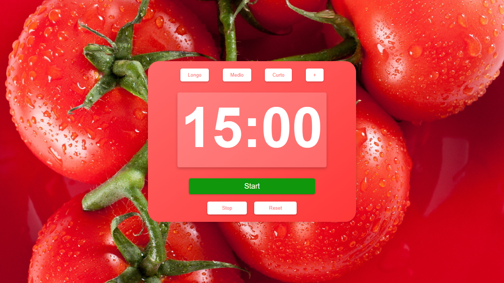

# 🍅 **Pomodoro Timer**

Este projeto é um temporizador Pomodoro simples e funcional. Ele permite ao usuário definir intervalos de tempo pré-configurados (5, 10 e 15 minutos) ou personalizar o tempo de acordo com sua preferência.

O temporizador foi desenvolvido com **HTML**, **CSS** e **JavaScript**, oferecendo uma interface amigável e fácil de usar.

---

## 🚀 **Funcionalidades**

- **Tempos Pré-definidos**: Opções rápidas de 5, 10 e 15 minutos para iniciar o temporizador.
- **Tempo Personalizado**: O usuário pode inserir manualmente o tempo desejado para o cronômetro.
- **Controle de Temporizador**: Botões para iniciar, pausar e reiniciar o temporizador.
- **Notificações de Conclusão**: Um aviso aparece quando o tempo se esgota.

---

## 🛠️ **Tecnologias Utilizadas**

- **HTML5**: Estruturação da página.
- **CSS3**: Estilo e responsividade do layout.
- **JavaScript**: Lógica do temporizador, interação com o DOM e manipulação de eventos.

---

## 🔧 **Como Executar o Projeto**

<a href="https://vinicius-rodriguess.github.io/Pomodoro-Timer/">Clique aqui para testar o projeto!</a>



Ou então:

1. **Clone este Repositório**:

   ```bash
   git clone https://github.com/Vinicius-Rodriguess/Pomodoro-Timer.git
   cd pomodoro-timer
   ```

2. **Abra o arquivo** `index.html` **em seu navegador** para ver o temporizador em ação.

---

## 🖥️ **Exemplo de Uso**

1. Escolha um tempo pré-definido (5, 10 ou 15 minutos) ou insira um tempo personalizado.
2. Clique no botão "Iniciar" para começar a contagem regressiva.
3. Pause o temporizador a qualquer momento usando o botão "Parar".
4. Reinicie o cronômetro com o botão "Resetar".

---

## ✅ **Melhorias Futuras**

- Adicionar funcionalidade para múltiplos ciclos Pomodoro, incluindo pausas curtas e longas.
- Implementar notificações sonoras ao final do temporizador.
- Desenvolver um tema noturno para melhorar a experiência do usuário.

---

## 👨‍💻 **Autor**

**Vinicius Rodrigues**

- GitHub: [Vinicius-Rodriguess](https://github.com/Vinicius-Rodriguess)
- Email: rodrigues.vini.2004@gmail.com
